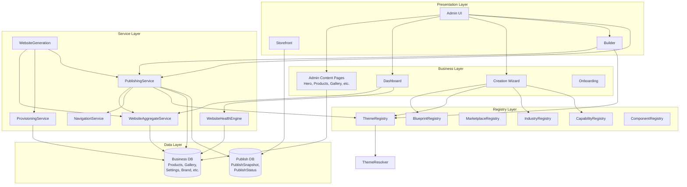
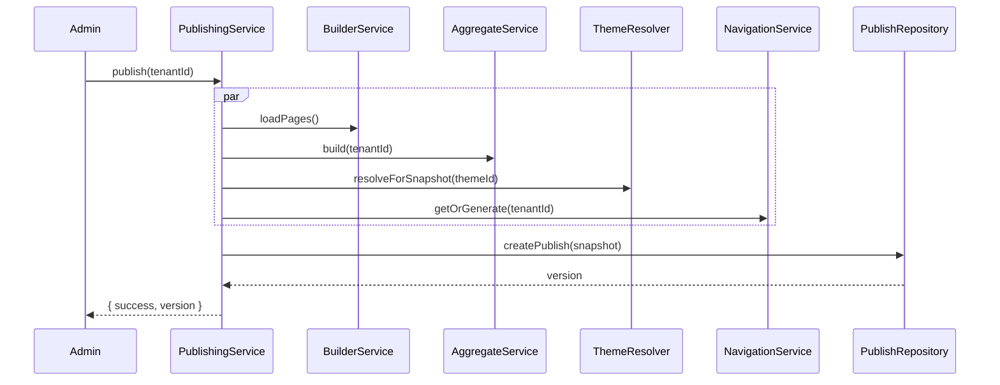
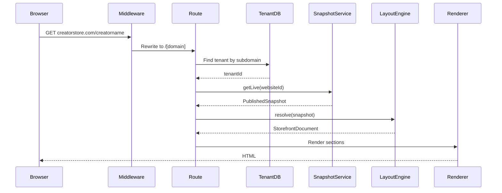
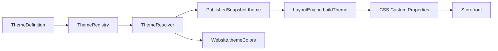
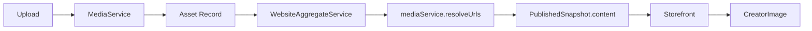
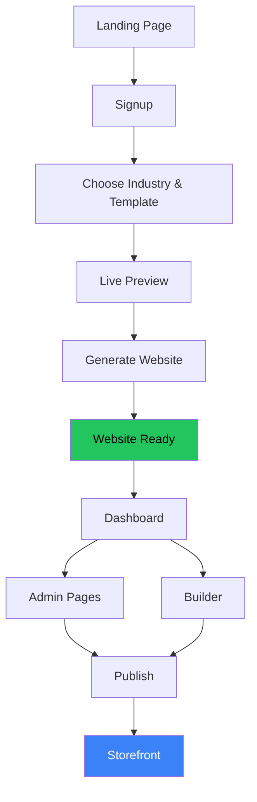
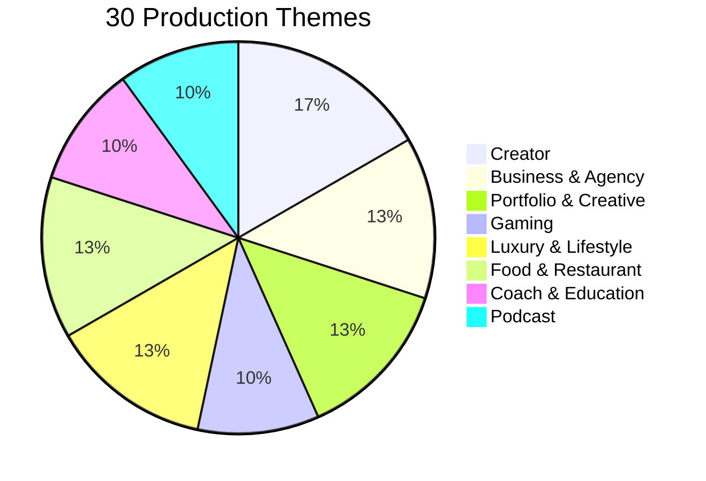

# Dependency Graph

> **Part of:** [Creatos Platform Architecture v1](platform-architecture-v1.md)

---

## 1. Platform Dependency Graph

## 2. Publishing Pipeline

## 3. Storefront Request

## 4. Theme Resolution

## 5. Media Resolution

## 6. Creator Journey

## 7. Theme Categories & Counts

